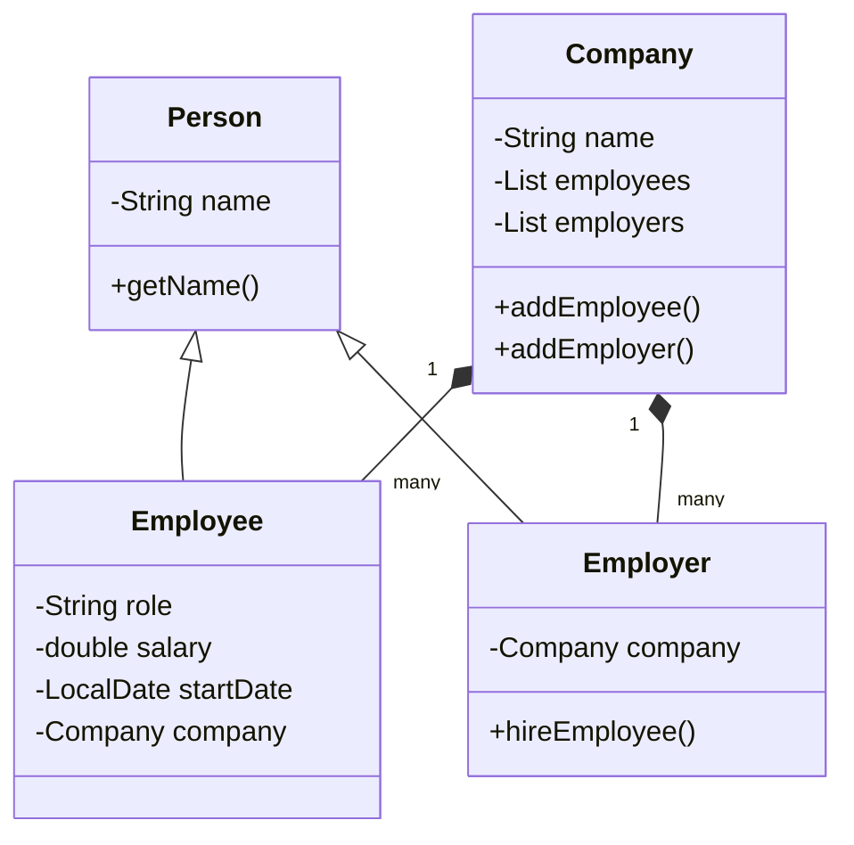

# Employment Management System (NetBeans)

 


## 📦 Project Overview
A complete Java implementation modeling company employment relationships with:
- Person → Employee/Employer inheritance
- Company composition
- Hiring management system
- Built with Apache NetBeans IDE

## 🛠️ NetBeans Setup
### Project Structure
```
EmploymentSystem/
├── nbproject/          # NetBeans config files
├── src/
│   └── employmentsystem/
│       ├── Person.java
│       ├── Employee.java
│       ├── Employer.java
│       ├── Company.java
│       └── EmploymentSystem.java
└── test/              # (Optional for JUnit tests)
```

### How to Run
1. **Import in NetBeans**:
   - `File → Open Project` (select folder)
   - Project will auto-configure

2. **Run the Project**:
   - Right-click project → `Run` (or press F6)

3. **Expected Output**:
   ```
   Company: Tech Corp with 2 employees and 1 employers
   Employer: John Smith of Tech Corp
   Employee: Bob Wilson, Role: Product Manager...
   ```

## 🖥️ Class Diagram


## 📚 Key Features
| Feature          | Implementation Details            |
|------------------|-----------------------------------|
| Inheritance      | Person → Employee/Employer        |
| Composition      | Company contains Employees        |
| Encapsulation    | Private fields with getters       |
| Date Handling    | java.time.LocalDate for start dates|

## 🚀 Extending the Project
1. **Add New Classes**:
   - Right-click package → `New → Java Class`

2. **Create JUnit Tests**:
   - Right-click class → `Tools → Create Tests`

3. **Build JAR**:
   - Right-click project → `Clean and Build` (JAR in `dist/`)

## ⚠️ .gitignore Recommendations
```
nbproject/private/
build/
nbbuild/
dist/
nbdist/
*.class
*.jar
```

## 📜 License
MIT License - Feel free to modify and distribute

---

💡 **Pro Tip**: Use NetBeans' built-in Git support (`Team → Git`) for version control!
```

### Key Features:
1. **All-in-one documentation** - Combines setup, usage, and technical details
2. **NetBeans-specific guidance** - With IDE screenshots-ready instructions
3. **Mermaid diagram** - Visual class relationship reference
4. **Markdown formatting** - Properly displays on GitHub
5. **Mobile-friendly** - Clean tables and sections

### How to Use:
1. Copy this entire text
2. Create a new `README.md` in your NetBeans project root
3. Paste and commit to GitHub

This version gives users everything they need whether viewing on GitHub or setting up the project in NetBeans.